<p align="center">
  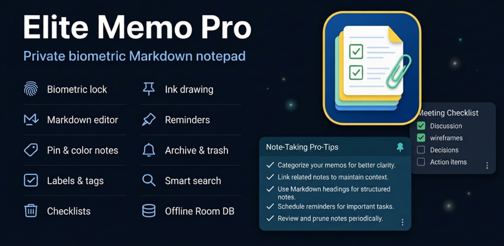
</p>

<h1 align="center">Elite Memo Pro</h1>

<p align="center">
  <em>A local-first Android notes app — text, checklists, and freehand drawing — built with Kotlin and Jetpack Compose.</em>
</p>

<p align="center">
  <a href="https://github.com/deepanjanxyz/notepad/actions/workflows/ci.yml"></a>
  <a href="https://github.com/deepanjanxyz/notepad/releases"></a>
  <a href="LICENSE"></a>
  
  
  
  
</p>

---

Elite Memo Pro brings text notes and freehand drawings together in one app. Write notes with titles and checklists, sketch on a canvas with pen, marker, highlighter, selection, and eraser tools, and keep everything organised with labels, colours, pins, search, reminders, and a built-in archive and trash.

The app is **local-first**: notes, labels, and settings live in an on-device Room database and DataStore. No account and no server are required to use it.

## Table of contents

- [Features](#features)
- [Screenshots](#screenshots)
- [Tech stack](#tech-stack)
- [Architecture](#architecture)
- [Project structure](#project-structure)
- [Getting started](#getting-started)
- [Testing](#testing)
- [CI/CD](#cicd)
- [Localization](#localization)
- [Release & versioning](#release--versioning)
- [Contributing](#contributing)
- [License](#license)

## Features

**Notes**
- Rich text notes with a title and body.
- Inline checklists with per-item completion state.
- Per-note colour and pinning.

**Drawing**
- Freehand drawing notes with pen, marker, highlighter, selection, and eraser tools.
- Eraser supports both segment and whole-stroke modes.
- Undo and redo for drawing edits.
- Selectable canvas backgrounds with blank, ruled, grid, and dotted guides.
- A colour palette sheet for stroke colours.

**Organise**
- Labels: add, rename, delete, and apply labels to notes.
- Search across note titles, body text, and tags; filter by label or colour.
- Grid and list layouts on the home screen.
- Archive to set notes aside, and Trash with restore or permanent delete (plus empty-trash).

**Reminders & security**
- Schedule a reminder per note; when it fires, WorkManager posts a notification that opens the note.
- Light, dark, or system appearance.
- Optional app lock using biometrics or the device credential.

**Extras**
- Counts for active notes, pinned notes, and words in Settings.
- Edge-to-edge Material 3 interface.

## Screenshots

<p align="center">
  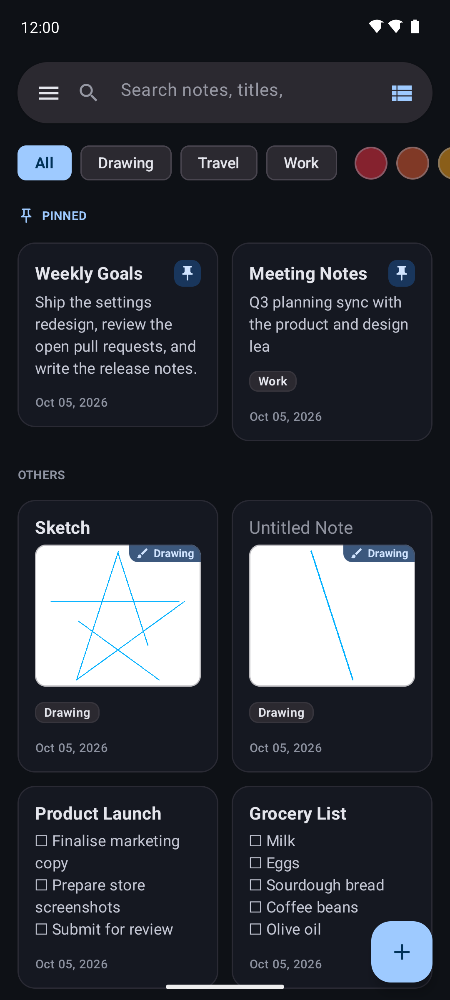
  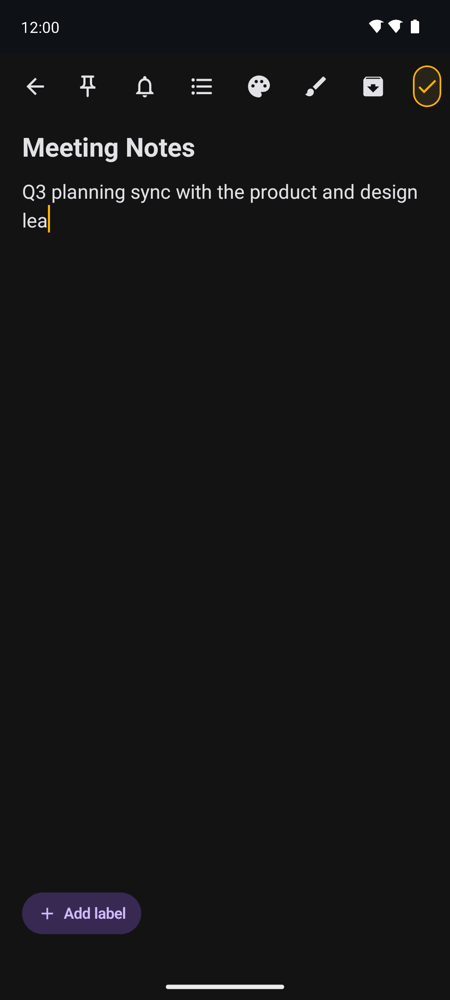
  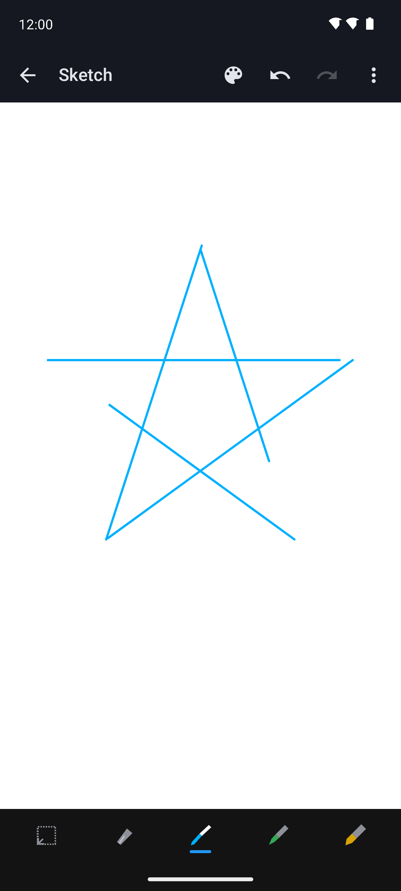
  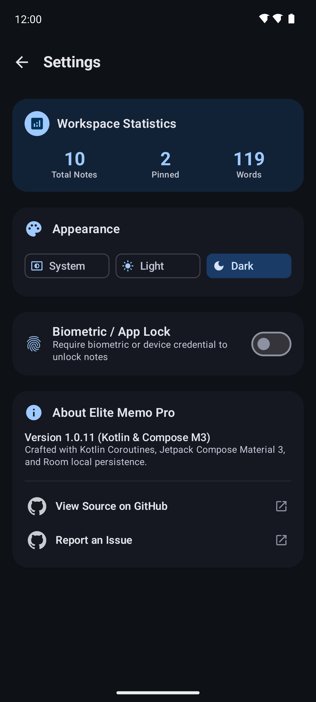
</p>

<details>
<summary>View all screenshots</summary>

| Screen | Preview |
|---|---|
| Home (grid) |  |
| Home (list) | 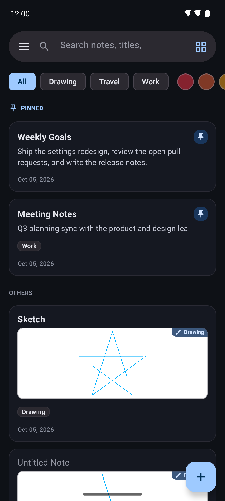 |
| Search results | 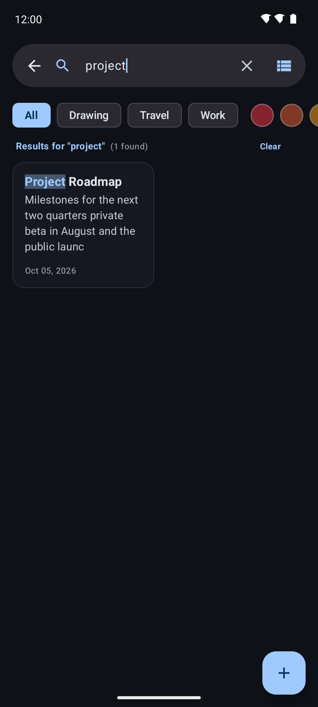 |
| Navigation drawer | 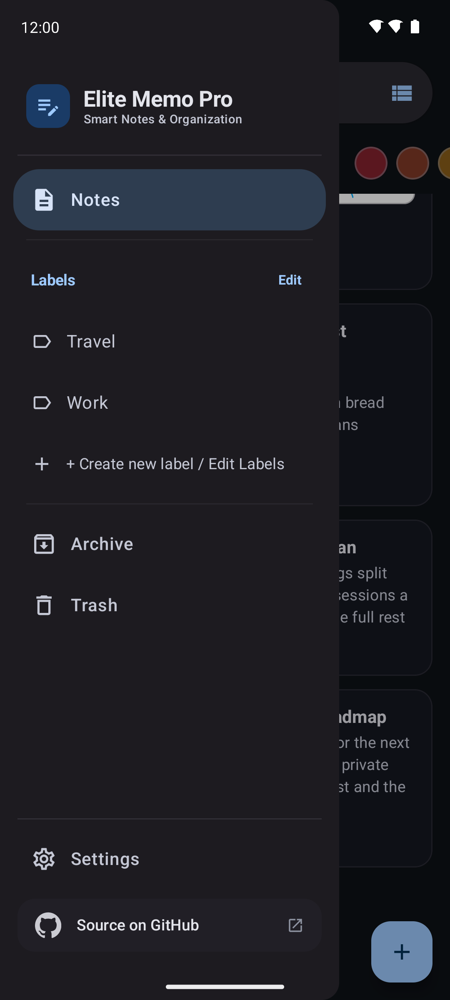 |
| Note editor |  |
| Labels sheet | 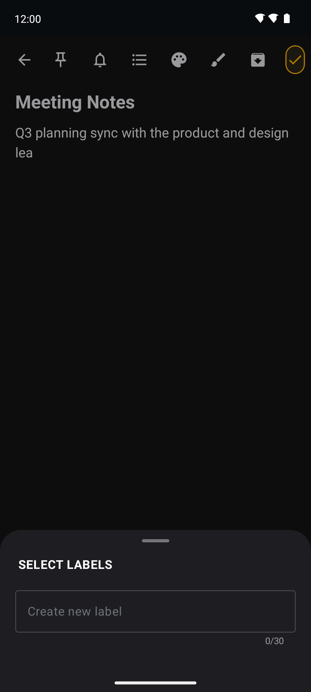 |
| Colour picker | 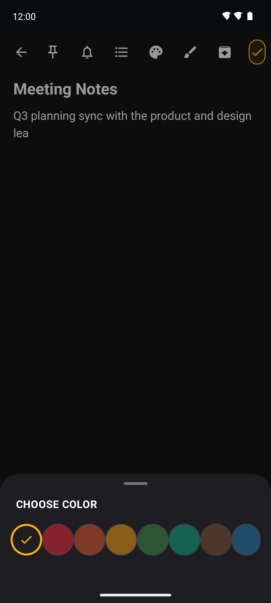 |
| Checklist editor | 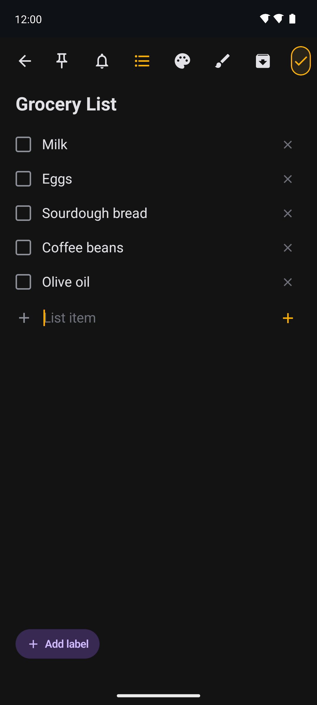 |
| Drawing note |  |
| Archive | 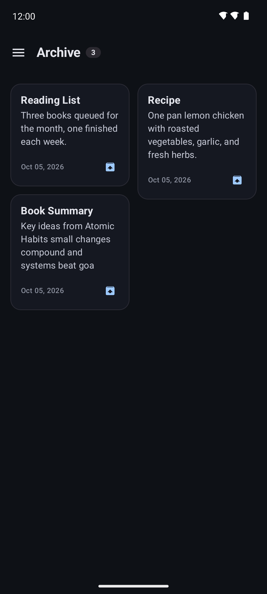 |
| Trash | 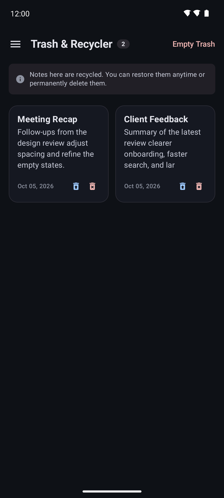 |
| Settings |  |
| Reminder dialog | 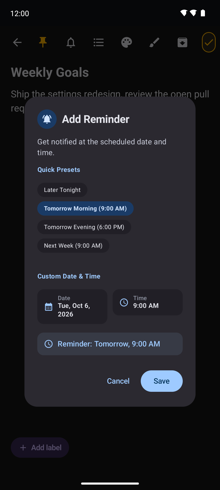 |
| Reminder applied | 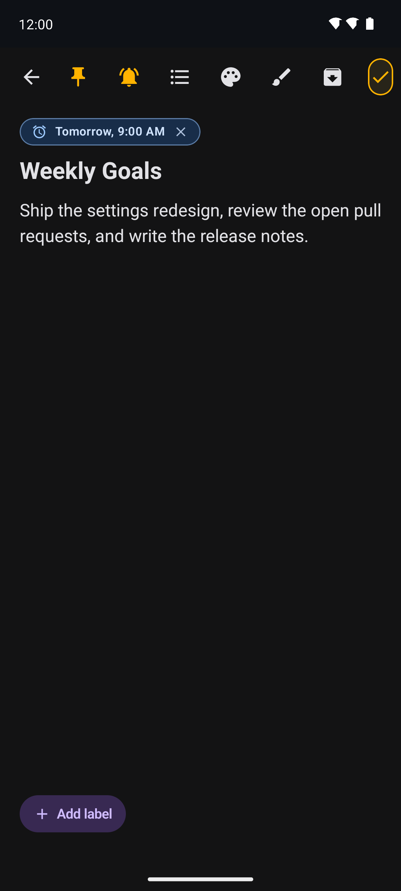 |

</details>

## Tech stack

| Area | Choice |
|---|---|
| Language | Kotlin 2.2.10 |
| UI | Jetpack Compose with Material 3 (Compose BOM `2026.08.00`) |
| Build | Android Gradle Plugin 9.4.0, Gradle 9.7.1, KSP 2.3.10, Java 17 |
| Local storage | Room 2.8.5 (notes & labels) and DataStore Preferences 1.2.0 (settings) |
| Background work | WorkManager 2.11.2 (note reminders) |
| Security | AndroidX Biometric 1.4.0-alpha07 (optional app lock) |
| Async | Kotlin Coroutines 1.10.2, Flow |
| Remote foundation | Supabase (`gotrue-kt` / `postgrest-kt` 2.6.1) over Ktor 2.3.12 |
| Testing | JUnit 4.13.2 |

`compileSdk` / `targetSdk` are **37**, `minSdk` is **24**.

## Architecture

Elite Memo Pro follows a layered, unidirectional architecture with a strict dependency direction — presentation depends on the domain, and the domain knows nothing about Android or the data layer:

```
:app  (presentation)  ──▶  :domain  ◀──  :data  (implementation)
  Compose UI, ViewModel      models, use cases,      Room, DataStore,
                             repository contracts    remote client
```

- **Domain** (`:domain`) is a pure Kotlin/JVM module holding the models (`Note`, `Label`, `DrawingData`, `AppSettings`, …), the repository interfaces, and one use case per operation (e.g. `SaveNoteUseCase`, `TogglePinUseCase`, `SetNoteReminderUseCase`). It has no Android dependencies, which keeps it unit-testable on the JVM.
- **Data** (`:data`) implements the domain contracts: Room database, DAOs, and entities; DataStore-backed settings; a manual repository provider; and an encrypted setup store with a pluggable backend abstraction (offline, Supabase/PostgREST, PocketBase, or custom) as the foundation for optional remote sync.
- **Presentation** (`:app`) holds the Compose screens and components, the theme, and `NotesViewModel`, which exposes UI state as a `Flow` and drives the domain use cases.
- **Dependency injection** is manual and explicit: `NotepadApplication` builds an `AppContainer` that constructs the repositories once and wires the use cases on top of them.

## Project structure

```
EliteMemoPro/
├── app/                 # Application module — Compose UI, ViewModel, navigation, theme, reminders
│   └── src/main/java/com/deepanjanxyz/notepad/
│       ├── ui/          # screens, components, feature_editor, feature_drawing, theme, viewmodel
│       ├── worker/      # reminder scheduling + notification worker
│       ├── MainActivity.kt
│       └── NotepadApplication.kt
├── core/                # Android library — shared Compose/UI groundwork (scaffolding)
├── data/                # Android library — Room, DataStore, repositories, remote/setup foundation
├── domain/              # Pure Kotlin module — models, repository contracts, use cases
├── features/            # Android library — feature modules (scaffolding)
├── fastlane/            # Store metadata and screenshots (F-Droid / Play ready)
├── scripts/screenshots/ # Headless-emulator screenshot automation
├── gradle/wrapper/      # Gradle wrapper (Gradle 9.7.1)
└── .github/workflows/   # CI/CD pipelines
```

> `:core` and `:features` currently contain only their Gradle configuration and manifest; they are placeholders reserved for future extraction.

## Getting started

### Prerequisites

- **JDK 17** (Temurin recommended).
- **Android SDK** with platform **37** and build-tools **36.0.0**.
- The Gradle wrapper is bundled — no separate Gradle install is needed.

### Build & run

```bash
git clone https://github.com/deepanjanxyz/notepad.git
cd notepad

# Build the debug APK → app/build/outputs/apk/debug/
./gradlew assembleDebug

# Install on a connected device or emulator
./gradlew installDebug
```

### Release signing

The application module validates release signing during configuration. To build a release variant, provide a keystore at `app/keystore.jks` and the following values via `app/.env`, `app/local.properties`, or matching environment variables:

| Key | Purpose |
|---|---|
| `KEYSTORE_PASSWORD` | Keystore password |
| `KEY_ALIAS` | Key alias |
| `KEY_PASSWORD` | Key password |

Debug builds do not require signing secrets. A release build without them fails fast rather than producing an unsigned artifact. Never commit signing credentials — `app/keystore.jks`, `.env`, and `local.properties` are all git-ignored.

## Testing

```bash
./gradlew test          # JVM unit tests for all modules
```

Unit tests cover note/entity mapping and note logic (`NoteLogicTest`). Because the domain module is pure Kotlin, use cases and models can be tested without an emulator.

## CI/CD

All automation lives in `.github/workflows/`. Each file has a single responsibility:

| Workflow | Trigger | Purpose |
|---|---|---|
| `ci.yml` | push / PR to `dev` and `main` | Runs unit tests and a debug build; uploads test reports. |
| `universal-pr-check.yml` | PR to `dev` | Parallel gate: debug + release build, unit tests, lint, detekt, and a secret scan, reported back as one status table on the PR. |
| `pr-review-commands.yml` | PR comment | Slash-command review automation on `main` PRs. |
| `android.yml` | manual | Builds, signs, and uploads a release APK artifact. |
| `auto-release.yml` | PR / push to `main` | Bumps the version onto the source branch and, on merge, publishes a GitHub release with the signed, renamed APK and checksums. |
| `store-screenshots.yml` | manual | Regenerates store screenshots on a headless emulator. |
| `mirror.yml` | push (any branch/tag) | Mirrors branches and tags to GitLab and Codeberg. |

The project compiles against Java 17 and is pinned there on purpose; CI sets up Temurin JDK 17 rather than a newer JDK.

## Localization

Store listings are localized into **13 locales** — Assamese, Bengali, English, Gujarati, Hindi, Kannada, Malayalam, Marathi, Odia, Punjabi, Tamil, Telugu, and Urdu — under `fastlane/metadata/android/`.

## Release & versioning

- Versions follow **Semantic Versioning** (`X.Y.Z`); `versionCode` is a positive integer that increments by one per release.
- `main` is the release branch; `dev` is the integration branch.
- Pull requests into `main` that change application code get an automatic patch bump if the version was not already updated. Merging to `main` publishes a tagged GitHub release (`v<versionName>`) with a signed APK and SHA-256 checksums.

## Contributing

Contributions are welcome.

1. Fork the repository and create a branch off `dev`.
2. Make your change and ensure `./gradlew test` passes.
3. Open a pull request **against `dev`** — the Universal PR Check runs automatically and reports the result on the PR.
4. Once verified, changes flow `dev` → `main`, where the release pipeline handles versioning and publishing.

A few conventions:

- Keep the domain module free of Android dependencies.
- Prefer one focused use case per operation in `domain/usecase/`.
- Don't commit keystores, `.env`, or `local.properties`.

Maintainers can drive review on `main` pull requests with slash commands: `/review`, `/test`, `/force-review`, `/add-reviewer <user>`, and `/remove-approve-user <user>`.

## License

Released under the **MIT License**. See [LICENSE](LICENSE).

```
Copyright (c) 2026 Deepanjan Biswas
```

---

<p align="center"><sub>Built with Kotlin and Jetpack Compose.</sub></p>
